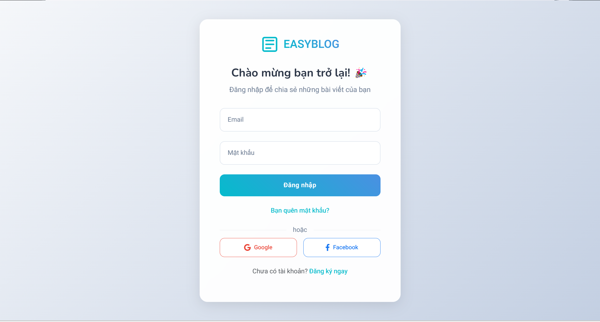
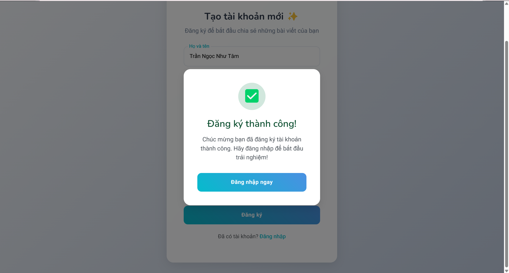
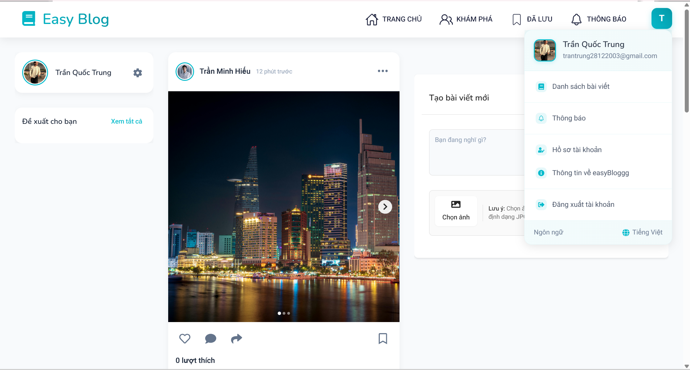
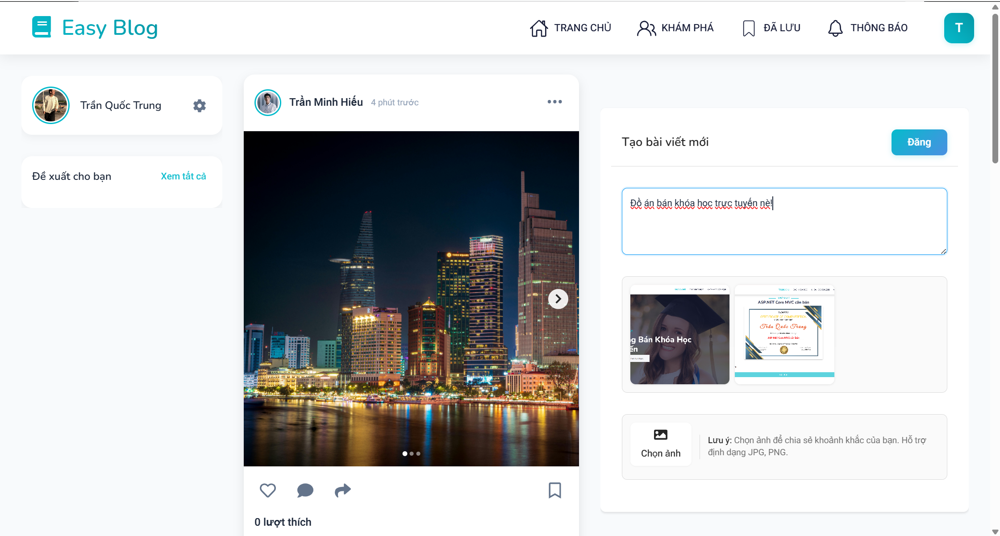

# 🚀 EasyBlog - Microservices Blogging Platform & API

## 📌 Giới thiệu

**EasyBlog** là một nền tảng blog dựa trên microservices, cho phép người dùng tạo, quản lý bài viết và tương tác với nhau thông qua các bình luận. Dự án được phát triển bằng **C# (ASP.NET Core Web API, SQL Server)** và **React**, tuân theo **Clean Architecture principles**.

## ✨ Tính năng chính

- 📝 Quản lý bài viết (thêm, sửa, xóa, tìm kiếm bài viết)
- 💬 Hệ thống bình luận
- 🔐 Xác thực người dùng bằng **JWT**
- 🏗 Kiến trúc **Microservices** với **API Gateway**
- ⚡ Realtime notification với **WebSocket** và **SignalR**
- ☁️ Lưu trữ ảnh trên **Cloudinary**
- 📂 Dịch vụ tải lên và quản lý tập tin
- 👥 Quản lý vai trò người dùng

## 🛠 Công nghệ sử dụng

- **Backend:** ASP.NET Core Web API
- **Frontend:** React
- **CSDL:** SQL Server
- **Xác thực:** JWT Authentication
- **API Gateway:** Ocelot
- **Realtime:** WebSocket, SignalR
- **Lưu trữ ảnh:** Cloudinary
- **Quản lý tập tin:** File Upload Service
- **Quản lý dự án:** Git, GitHub

## 🚀 Cài đặt và chạy dự án

### 1️⃣ Clone repository

```bash
git clone https://github.com/trantrung28122003/EasyBlog.git
cd EasyBlog
```

### 2️⃣ Cấu hình và chạy Backend

#### Các Dịch vụ Service khác

```bash
cd {NameSerice}.Presentation
dotnet restore
dotnet run
```

#### Dịch vụ API Gateway

```bash
cd ApiGateway.Presentation
dotnet restore
dotnet run
```

### 3️⃣ Cấu hình và chạy Frontend

```bash
cd frontend
npm install
npm start
```

## 🎨 Hình ảnh giao diện

### 🔑 Xác thực & Người dùng

- **🔒 Trang đăng nhập**  
  
- **👤 Trang đăng kí**  
  

### 📝 Bài viết & Bình luận

- **📚 Danh sách bài viết**  
  
- **📝 Chi tiết và Bình luận bài viết**  
  

### 🔔 Thông báo

- **📢 Hệ thống thông báo realtime**  
  

### 📂 Quản lý tập tin

- **📤 Giao diện tải lên tập tin**  
  

## 🤝 Đóng góp

Mọi đóng góp đều được hoan nghênh! Hãy tạo pull request hoặc liên hệ qua email: `trantrung28122003@gmail.com` 💎.
